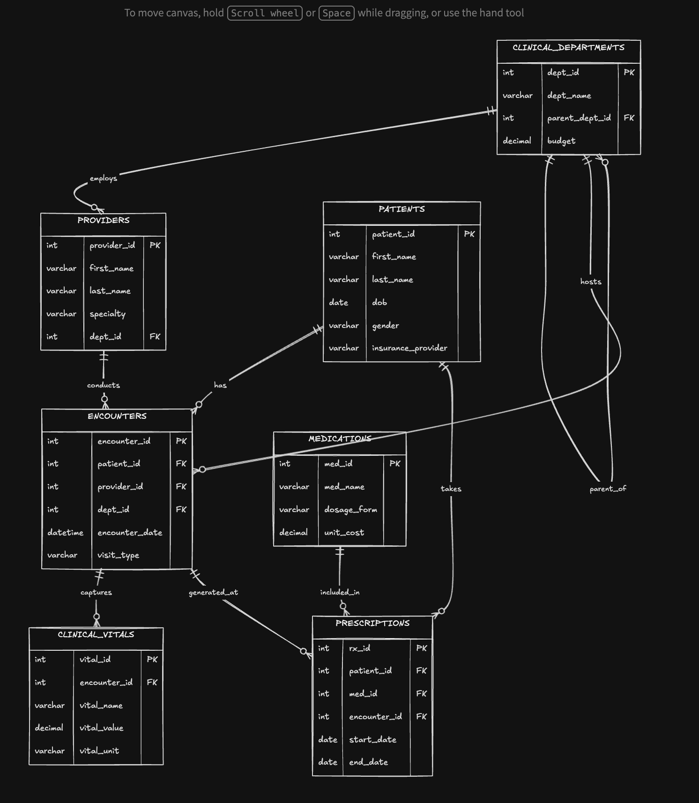

  

# 🏥 Day 002 of #100DaysOfSQL — Entity Relationship Diagram (ERD) for PulsePoint Hospital

## 📋 Project Overview
On Day 2 of my **100 Days of SQL Challenge**, I designed a complete **Entity-Relationship Diagram (ERD)** for **PulsePoint**, a realistic hospital management system.

🗂️ <b>Database Tables (7)</b>

| Table | Description |
|-------|-------------|
| 🏢 <b>Clinical_Departments</b> | Hospital departments, supports hierarchy |
| 👩‍⚕️ <b>Providers</b> | Doctors & nurses |
| 🧑‍🤝‍🧑 <b>Patients</b> | Patient records |
| 📋 <b>Encounters</b> | Patient visits |
| ❤️ <b>Clinical_Vitals</b> | Vital signs per encounter |
| 💊 <b>Medications</b> | Drug catalog |
| 📝 <b>Prescriptions</b> | Med orders for patients |

---

## 🗺️ What is an ERD?

An **Entity-Relationship Diagram (ERD)** is the architect’s blueprint for a database. It visually shows:
- 🗃️ **Entities** (tables)
- 🏷️ The data stored in each table
- 🔗 How the tables are **connected** to each other

> 🩺 Just like a surgeon needs a clear understanding of the patient’s anatomy before operating, a developer needs a solid ERD before writing SQL to avoid messy data and broken relationships.

### 🌟 Why ERDs Matter
- Prevents data duplication
- Ensures data accuracy and consistency
- Makes future SQL queries easier and faster
- Helps the entire team understand the system at a glance

---

## 🧩 Key Concepts

### 🔑 Primary Key (PK) & Foreign Key (FK)
- **Primary Key (PK)**: Unique identifier for each record.  
  *🏷️ Analogy*: A patient’s unique Hospital Medical Record Number (MRN) — it never repeats.

- **Foreign Key (FK)**: A pointer that links one table to another.  
  *🩺 Healthcare analogy*: The patient ID printed at the top of every lab report, prescription, or vital signs sheet. It always points back to the correct patient.

### 🦶 Crow’s Foot Notation & Cardinality
In the ERD, lines connect tables with special symbols at the ends (**crow’s foot notation**). These symbols represent **cardinality** — *how many* records from one table can relate to another.

**Symbols**:
- `|` = Exactly **one** (mandatory)
- `o` = **Zero or one** (optional)
- `><` (crow’s foot) = **Many**

**Common combinations**:
- `|-----<` = **One-to-Many** (mandatory on the “one” side)
- `o-----<` = **One-to-Many** (optional on the “one” side)

*Don’t worry — full explanation of how they apply in PulsePoint is below.*

---

## 🏗️ Detailed ERD Breakdown

### 1. 🏢 CLINICAL_DEPARTMENTS
- **PK**: `dept_id`
- Important column: `parent_dept_id` (self-referencing FK)

**Self-Referencing Relationship**  
🔄 If you look at the ERD, there is a line pointing back to the same table. This is called a **self-referencing relationship**.

`parent_dept_id` points to `dept_id` **within the same table**.  

**Real-world reason**: In a hospital, a large department like **Internal Medicine** (`dept_id = 1`) can have multiple subunits under it — e.g., **Cardiology** (`dept_id = 3`, `parent_dept_id = 1`).  
→ **Internal Medicine** is the **parent department**, and **Cardiology** is the **child/sub-unit**.  
This allows clean hierarchical reporting and budgeting.

### 2. 👩‍⚕️ PROVIDERS (Doctors & Nurses)
- **PK**: `provider_id`
- **FK**: `dept_id` → CLINICAL_DEPARTMENTS
- Relationship: **One Department employs Many Providers** (`|-----<`)

**Example**: The Pediatrics department can have many doctors and nurses (Dr. Marie Jensen, Dr. Michael Campbell). However, a single doctor like Dr. Ani can only be assigned to **one** department at a time.

### 3. 📋 ENCOUNTERS (Patient Visits) – Central Table
- **PK**: `encounter_id`
- **FKs**: `patient_id`, `provider_id`, `dept_id`

**Key Relationships**:
- 👩‍⚕️ One Provider **conducts** many Encounters (Dr. James Morales can handle ER visits, follow-ups, and telehealth in a day)
- 🧑‍🤝‍🧑 One Patient **has** many Encounters (Mr. John can visit multiple times)
- 📈 One Encounter **captures** many Clinical Vitals
- 📝 One Encounter **generates** Prescriptions

### 4. 📦 Other Tables
- **❤️ CLINICAL_VITALS**: Stores vital readings linked to an encounter
- **💊 MEDICATIONS**: Drug information
- **📝 PRESCRIPTIONS**: Links patients, medications, and encounters with start/end dates

---

## 🏥 Real-Life Story: Mr. John’s Visit at PulsePoint Hospital

Mr. John (patient_id 1001) arrives at the hospital with chest pain.

1. His personal details are already stored in the **🧑‍🤝‍🧑 PATIENTS** table.
2. A new **📋 ENCOUNTER** record is created (linked to Dr. James Morales in Cardiology department).
3. Nurses record his **❤️ CLINICAL_VITALS** (blood pressure, heart rate, temperature, etc.) — all tied to that same encounter.
4. The doctor writes a **📝 PRESCRIPTION**, which is linked back to the encounter and the medication from the **💊 MEDICATIONS** table.
5. When generating reports, the system shows that Cardiology falls under **Internal Medicine** thanks to the self-referencing `parent_dept_id`.

Later, if Mr. John returns for an Orthopedics appointment, his full history remains easily accessible and consistent.

---

## 📁 Files in this Repository

- 🖼️ `ERD.png` → The complete Entity-Relationship Diagram (see top)
- 📊 `PulsePoint_Master_Data.xlsx` → Sample data for all 7 tables

## ⏭️ Next Steps (Day 3)
Convert this ERD into actual SQL `CREATE TABLE` statements with proper constraints and relationships.

---

---

  
   
  <i>Follow the diagram above for a visual guide to all relationships!</i>

**Feedback welcome!**  
If you're learning SQL or database design, feel free to share your thoughts or questions in the comments on LinkedIn.

#100DaysOfSQL #SQL #DatabaseDesign #ERD #LearnInPublic

---

